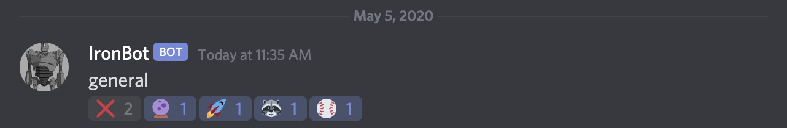
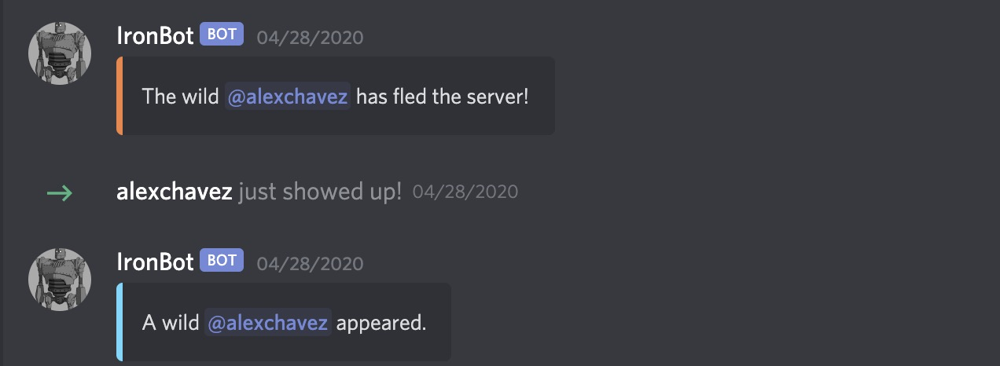

# IronBot
IronBot is an internet chat bot that interacts with the Discord chat room. The IronBot is able to execture commands and perform routine tasks (e.g. Online searches).

## Getting Started
Discord bots are automated robots that join your server and are able to be customized. The Discord bot has code that it exectures in the background whne it encounters triggered specific events. When a specific event happens in your Discord server, the bot will notice it and respond by executing its commands. 
The following instructions will allow you to run our project on your local machine for development and testing purposes. 

### Requirements
* Discord Account
* Java
* Java Discord API (JDA)
* Visual Studio Code

### Installing
1. Clone the repository
```
$ git clone https://github.com/deanguardanapo/IronBot.git
```

### Features
* **callBot()** - Activates IronBot, allows you to view the bots functions.
* **commandBot()** - Sets a playing message (what the IronBot is doing), changes online status (online, offline, idle.
* **addReaction()** - IronBot will send a random reaction, only the user has access to delete their own reaction, other members can react to the reaction. 

* **clearCommand()** - IronBot will delete commands previously made, only deletes messages within two weeks. 

* **GuildMemberLeave()/GuildMemberJoin()** - IronBot will notify the members who are in the server once somebody has either left or joined the server with a unique string output each time.
 

## Authors
* **Dean Guardanapo** - [Github](https://github.com/Deanguardanapo)
* **Prem Dhar** - [Github](https://github.com/PremDh)
* **Alex Chavez** - [Github](https://github.com/Alexchavez1)
* **Simran Bains** - [Github](https://github.com/Simranb82232)
